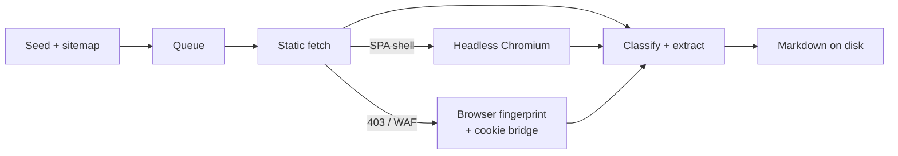

# scrape-website

<a href="LICENSE"></a>


Crawl an entire domain and turn it into a clean, LLM-ready knowledge base: raw
HTML, extracted Markdown with metadata, and every linked PDF and Office
document converted to Markdown too. Fast, polite, and able to get through
JavaScript apps, WAFs, and bot challenges.

## Table of Contents

- [Quick Install](#quick-install)
- [Overview](#overview)
- [Features](#features)
- [Usage](#usage)
- [Output](#output)
- [How It Works](#how-it-works)
- [Documentation](#documentation)
- [Contributing](#contributing)
- [License](#license)

## Quick Install

```bash
git clone https://github.com/ventz/scrape-website.git
cd scrape-website
uv sync
uv run playwright install chromium
uv run python app.py https://example.com/
```

Requires Python 3.13+ and [uv](https://docs.astral.sh/uv/). The Chromium
download is only needed for JavaScript rendering; skip it and pass
`--render never` to run without a browser.

## Overview

Point it at a site and it crawls every same-domain page, then writes Markdown
you can feed straight into a RAG pipeline or an LLM context window. Each page
and document becomes a self-contained `.md` file with front matter (`title`,
`url`, `hostname`, …), with navigation and boilerplate stripped.

It fetches statically first and only escalates when it needs to: headless
Chromium for client-rendered SPAs, a real-browser TLS fingerprint for WAF
blocks, and your own Chrome's cookies for the hardest Cloudflare walls.
Extraction is fully deterministic, with no LLM calls (see
[How It Works](#how-it-works)).

## Features

- **Async and fast** — up to 100 concurrent requests, parsing spread across all CPU cores
- **Polite by default** — global rate limit (`--delay`, ~10 req/s), `robots.txt` and `Crawl-Delay` honored
- **JavaScript rendering** — SPA shells are detected and re-fetched in headless Chromium automatically
- **Gets through WAFs** — `curl_cffi` browser-fingerprint fallback, plus a cookie bridge for Cloudflare Private Access Token walls
- **Human-in-the-loop mode** — `--human` opens a visible browser and pauses for you to solve challenges or log in; sessions persist across runs
- **Documents to Markdown** — PDF, DOC(X), PPT(X), XLS(X) and more, downloaded and extracted
- **Page classification** — challenges, 404s (incl. soft-404s), denials, and search pages are logged, not archived as content
- **Per-page dedup only** — content shared across pages is kept on each page, so nothing silently goes missing
- **Crash recovery** — SQLite checkpoints every 30s; re-run to resume, `--retry` to re-fetch failures
- **Hardened** — SSRF guard on crawled links, size caps against compression bombs, strict TLS by default
- **Usable as a library** — the tiered `FetchEngine` is importable on its own

## Usage

```bash
# Crawl one domain
uv run python app.py https://example.com/

# Crawl many domains in parallel (one URL per line)
uv run python app.py --file urls.txt

# Re-fetch URLs that failed
uv run python app.py --retry data/example.com/logs/failed_urls.txt

# Start over, overwriting previous output
uv run python app.py https://example.com/ --fresh

# Gentler crawl: 20 concurrent, ~2 req/s
uv run python app.py https://example.com/ -c 20 -d 0.5

# Site behind a challenge or login
uv run python app.py --human https://example.com/
```

All flags are listed in the [CLI reference](docs/usage.md#cli-reference).

## Output

```
data/example.com/
  pages/   # raw HTML
  text/    # Markdown + front matter, for pages and documents
  files/   # downloaded PDFs, Office docs, etc.
  logs/    # scrape.log, state.db, failed/denied/not-found/challenged reports
```

Details and a sample run are in [Output](docs/output.md).

## How It Works



**Does it use an LLM? No.** Main-content extraction is `trafilatura`
heuristics, documents go through `pymupdf4llm` and `markitdown` converters, and
SPA and challenge detection are hand-written rules. There are no model API calls
and no API keys, and crawled content never leaves your machine. "LLM" in the
project only describes the output's audience. The optional Docling fallback
for scanned PDFs uses local non-generative models and isn't installed by
default. See [Architecture](docs/architecture.md#does-it-use-an-llm).

## Documentation

| Guide | Description |
|---|---|
| [Usage](docs/usage.md) | Input modes, retry/resume, rate limiting, crawl knobs, full CLI reference |
| [Protected Sites](docs/protected-sites.md) | WAF fallback, `--human` mode, the cookie bridge for Cloudflare PAT walls |
| [Output](docs/output.md) | Directory layout, Markdown format, deduplication |
| [Configuration](docs/configuration.md) | Environment variables, built-in limits, install extras |
| [Architecture](docs/architecture.md) | Pipeline, fetch tiers, extraction stack, package layout |
| [Library Usage](docs/library.md) | Using `FetchEngine` from your own code |
| [Changelog](CHANGELOG.md) | Release history |

## Contributing

```bash
uv sync
uv run pytest tests/
```

The suite includes an end-to-end crawl against a local fixture server, so it
never touches the network. Bump `__version__` in `scrape_website/__init__.py`
and `pyproject.toml` together, and add a [CHANGELOG](CHANGELOG.md) entry for
user-visible changes.

## License

[MIT](LICENSE) © Ventz Petkov
