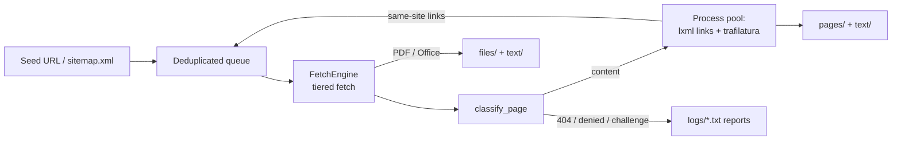

# Architecture

How a crawl moves from a seed URL to Markdown on disk, and why each tier exists.

## Contents

- [Pipeline](#pipeline)
- [Tiered fetching](#tiered-fetching)
- [Extraction](#extraction)
- [Does it use an LLM?](#does-it-use-an-llm)
- [Package layout](#package-layout)

## Pipeline

1. Seeds come from the CLI, a URL file, `--retry`, and `sitemap.xml`.
2. A deduplicated queue (in-memory set, write-through to SQLite) feeds the
   concurrent workers, paced by one global rate limiter (`--delay`) and
   `robots.txt`.
3. `FetchEngine` fetches each URL through the cheapest tier that works.
4. `classify_page` labels every HTML response: content, anti-bot challenge
   (with vendor), not found (incl. soft-404), access denied, or search page.
   Only content is archived.
5. Link extraction and text extraction run in a `ProcessPoolExecutor` across
   all CPU cores.
6. Queue and stats checkpoint to SQLite every 30 seconds, so a killed run
   resumes where it stopped.

## Tiered fetching

Each tier is tried only when the one before it can't deliver the page, so a
normal site never pays for a browser.

| Tier | Tool | Triggered when |
|---|---|---|
| 1. Static | `aiohttp` | Always first. Backoff with jitter, `Retry-After` on 429/5xx |
| 2. JS render | Playwright headless Chromium | Page looks like an un-hydrated SPA shell (tiny text + SPA marker, or zero links) |
| 3. Browser fingerprint | `curl_cffi` (`impersonate='chrome'`) | 401/403, WAF block, or a 200 Cloudflare "Just a moment" interstitial |
| 4. Cookie bridge | `curl_cffi` + your real Chrome's cookies | Still blocked, e.g. Cloudflare Private Access Token walls |
| `--human` | Visible, persistent Chromium | You opt in; the crawl pauses for you to solve challenges or log in |

Tiers 3-4 and `--human` are covered in depth in
[Protected Sites](protected-sites.md).

## Extraction

| Input | Converter | Method |
|---|---|---|
| HTML → Markdown | [`trafilatura`](https://github.com/adbar/trafilatura) | Boilerplate removal by DOM heuristics and text-density scoring |
| Links | `lxml` | HTML parsing |
| PDF → Markdown | [`pymupdf4llm`](https://github.com/pymupdf/pymupdf4llm) | Layout rules over PyMuPDF text blocks |
| DOC(X), PPT(X), XLS(X) → Markdown | [`markitdown`](https://github.com/microsoft/markitdown) | Per-format converters |
| Scanned / complex PDFs (optional) | [`docling`](https://github.com/docling-project/docling) | Local layout + OCR models, only if installed |

Deduplication inside `trafilatura` is reset before every page, so repeated
boilerplate is dropped only *within* a page. See [Output](output.md#deduplication).

## Does it use an LLM?

**No.** The scraper makes no calls to any LLM: no hosted model APIs, no local
model runners, and no API keys. Crawling, page classification, and extraction
are deterministic, so the same input produces the same output, costs nothing
per page, and never sends crawled content to a third party.

"LLM" shows up in the project only to describe **who the output is for**:

- `text/` holds Markdown with YAML front matter, shaped for RAG pipelines and
  LLM context windows.
- `pymupdf4llm` is named for its purpose ("PDF to Markdown for LLMs"). It is a
  rule-based converter, not a model.

What does the work instead:

- **Page understanding** — `trafilatura` heuristics pick the main content.
- **SPA and challenge detection** — hand-written rules in
  `_looks_like_spa_shell` and `classify_page` (marker strings, text length,
  link counts, HTTP status, vendor fingerprints).
- **Documents** — `pymupdf4llm` and `markitdown` converters.

The one exception is the optional **Docling** fallback. It runs local ML
models (layout detection and OCR, via PyTorch) when the fast PDF path returns
almost no text, e.g. for scanned documents. These models are not generative
LLMs, they run entirely on your machine, and Docling is **not installed by
default**. Add it with `uv add docling` if you need it.

## Package layout

| Module | Responsibility |
|---|---|
| `config.py` | `CONFIG` defaults, marker tuples, downloadable types, default excludes |
| `urls.py` | Normalization, tracking-param stripping, excludes, SSRF gate |
| `sitemap.py` | `sitemap.xml` and sitemap-index discovery |
| `extract.py` | Link/text/document extraction, SPA heuristic, `classify_page` |
| `waf.py` | Cookie bridge (`CF_SESSION`) |
| `fetch.py` | `FetchEngine` / `FetchOutcome`, the reusable tiered fetcher |
| `store.py` | `URLStore`, SQLite visited/queue/checkpoint state |
| `crawler.py` | `WebsiteScraper`: output tree, progress, process pool |
| `cli.py` | Argument parsing and `main()` |

`app.py` at the repo root is a compatibility shim and the CLI entry point.
